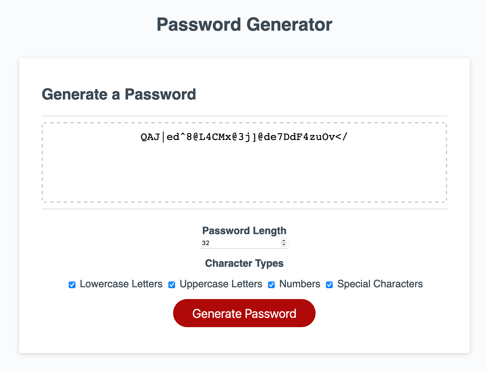

# Password Generator
## Gavin Asay

This is a simple password generator. To start, I defined an array _characters_ with four elements:
1. lowercase letters a-z
2. uppercase letters A-Z
3. numbers 0-9
4. various special characters.

Rather than use window alerts or prompts that create a halting user experience, I opted to build an HTML form. A number input determines the length of the password, while checkboxes determine what character types are used. The number input defines the variable _userLength_ while the checkbox states become elements of the array _selectedTypes_.

From here, a series of if and if-else statements check whether the length falls is too short or long, if no character types have been selected, or both. If so, an appropriate error message is printed to the page. If user input validates correctly, the final else statement carries out the bread and butter of the function.

A for-loop checks the value of each element of _selectedTypes_. If a given element is true based on checkbox status, it then concatenates those elements into a new variable _characterPool_. Then, another for-loop with condition _i &lt; userLength_  selects a random character from characterPool and concatenates that character into variable _passwordBuild_. At the end of the loop, the function returns _passwordBuild_.

This allows the page to repeatedly generate new passwords without user interactivity being interrupted by alerts and without reloading. Finally, a small tweak to the existing _writePassword()_ function prevents the script from writing 'undefined' to the password text area if user input fails to validate.

https://github.com/gavin-asay/Week3Challenge/

https://gavin-asay.github.io/Week3Challenge/

